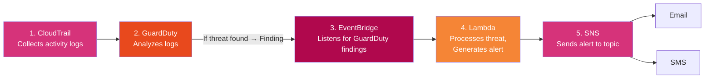

# Automated AI-Powered AWS Threat Detection System


**A real-time, serverless security pipeline that detects threats in AWS accounts, enriches them with AI-generated context, and alerts admins instantly via Email/SMS — fully automated, zero servers to manage.**

---

## Overview

This project is an end-to-end threat detection and incident-response system built entirely on native AWS services. It continuously monitors account activity, automatically detects malicious behavior — crypto-mining, unauthorized access, backdoors, data exfiltration, and more — and turns raw security findings into clear, actionable alerts within minutes.

It's designed to demonstrate practical, production-style skills in **cloud security, serverless architecture, Infrastructure as Code, and applied AI (Amazon Bedrock)** — packaged as a fully deployable, one-command system rather than a toy demo.

## Features

- **Continuous threat monitoring** across CloudTrail, VPC Flow Logs, and DNS logs via Amazon GuardDuty
- **Real-time alerting** — findings reach admins within minutes via Email and SMS
- **Optional AI enrichment** using Amazon Bedrock (Claude) for plain-English risk summaries
- **Grounded remediation guidance** from a curated knowledge base, so alerts never rely solely on model output
- **Fully Infrastructure-as-Code** — one CloudFormation template deploys the entire stack
- **One-command deploy/destroy** via shell scripts
- **Built-in test tooling** — simulate real GuardDuty findings or invoke the Lambda directly
- **Live Streamlit dashboard** — explore the system's exact detection logic with zero AWS credentials required
- **Least-privilege IAM** and encrypted, public-access-blocked storage by default

## Architecture Diagram



## Architecture Table

| # | Service | Role |
|---|---------|------|
| 1 | **CloudTrail** | Records all API activity across the account (management events, multi-region). |
| 2 | **GuardDuty** | Continuously analyzes CloudTrail, VPC Flow Logs, and DNS logs using threat intelligence and anomaly detection. Emits a **Finding** when malicious/suspicious behavior is detected. |
| 3 | **EventBridge** | A rule matches `aws.guardduty` / `GuardDuty Finding` events and routes them to Lambda in near real time. |
| 4 | **Lambda** | Parses the finding, maps it to a remediation knowledge base (or optionally calls **Amazon Bedrock** for an AI-generated summary), formats a readable alert, and publishes it to SNS. |
| 5 | **SNS** | Fans the formatted alert out to all subscribers. |
| 6 | **Email / SMS** | Admins receive a real-time security alert with severity, description, and concrete remediation steps. |

## Technology Stack

| Category | Tools / Services |
|---|---|
| **Cloud Provider** | AWS |
| **Security & Detection** | Amazon GuardDuty, AWS CloudTrail |
| **Compute** | AWS Lambda (Python 3.12) |
| **Eventing / Messaging** | Amazon EventBridge, Amazon SNS |
| **AI / ML** | Amazon Bedrock (Claude models) |
| **Infrastructure as Code** | AWS CloudFormation |
| **Testing** | Pytest, custom simulation scripts |
| **Web Dashboard** | Streamlit |
| **Languages** | Python, Bash, YAML |

## Repository Structure

```
aws-threat-detection-system/
├── README.md
├── lambda/
│   ├── threat_processor.py      # Main Lambda handler
│   ├── enrichment.py            # Optional Amazon Bedrock AI enrichment
│   ├── test_threat_processor.py # Unit tests (pytest)
│   └── requirements.txt
├── infrastructure/
│   └── cloudformation/
│       └── template.yaml        # Full IaC: CloudTrail, GuardDuty, EventBridge, Lambda, SNS
├── iam/
│   └── lambda-execution-role-policy.json  # Reference IAM policy
├── scripts/
│   ├── deploy.sh                 # One-command deploy
│   ├── destroy.sh                 # Tear down the stack
│   ├── simulate_finding.sh         # Trigger GuardDuty's sample findings
│   └── test_lambda.py              # Invoke the deployed Lambda directly
├── docs/
│   └── setup-guide.md              # Step-by-step manual console walkthrough
└── streamlit_app/
    ├── app.py                      # Standalone dashboard running the same detection logic (no AWS needed)
    └── requirements.txt
```

## How It Works

1. **CloudTrail** records every API call made across the AWS account.
2. **GuardDuty** continuously analyzes that activity (plus VPC Flow Logs and DNS logs) against threat intelligence feeds and anomaly-detection models.
3. When GuardDuty identifies suspicious or malicious behavior, it emits a **Finding**.
4. **EventBridge** picks up the finding in near real time and routes it to a Lambda function.
5. **Lambda** parses the finding, matches it against a remediation knowledge base (optionally calling **Amazon Bedrock** for an AI-generated summary), and formats a clear, actionable alert.
6. **SNS** delivers that alert to every subscriber — instantly, via **Email and SMS**.

The result: a security team hears about a real threat within minutes, complete with severity, context, and concrete next steps — with no dashboards to babysit.

## Getting Started

### Prerequisites

- An AWS account with permissions to create IAM roles, CloudTrail, GuardDuty, EventBridge rules, Lambda functions, and SNS topics.
- [AWS CLI](https://docs.aws.amazon.com/cli/latest/userguide/getting-started-install.html) v2, configured (`aws configure`).
- Python 3.12 (for local testing) and `zip` (for packaging).
- GuardDuty must not already be enabled in the target account/region (only one detector is allowed per account per region) — or set `EnableGuardDuty=false` when deploying if it already is.

### Deploy in One Command

```bash
git clone https://github.com/<your-username>/aws-threat-detection-system.git
cd aws-threat-detection-system

chmod +x scripts/*.sh

./scripts/deploy.sh you@example.com +15551234567 us-east-1
```

This will:
1. Package `lambda/threat_processor.py` + `lambda/enrichment.py` into a zip.
2. Deploy the CloudFormation stack (`infrastructure/cloudformation/template.yaml`), creating CloudTrail, GuardDuty, the EventBridge rule, the Lambda function, and the SNS topic with your Email/SMS subscriptions.
3. Push the real Lambda code onto the deployed function.

> **Important:** Check your inbox for an "AWS Notification - Subscription Confirmation" email and click **Confirm subscription** — SNS will not deliver email alerts until this is confirmed. SMS subscriptions activate immediately.

## Testing

GuardDuty ships with a built-in sample finding generator, so there's no need to wait for or fabricate real malicious activity:

```bash
./scripts/simulate_finding.sh us-east-1
```

This creates one sample finding for every GuardDuty finding type. Within a few minutes you should receive Email/SMS alerts for any findings at or above your configured `MinSeverity` threshold.

Alternatively, invoke the Lambda directly with a synthetic event, bypassing GuardDuty and EventBridge entirely:

```bash
python3 scripts/test_lambda.py guardduty-threat-processor us-east-1
```

Watch Lambda execution logs live:

```bash
aws logs tail /aws/lambda/guardduty-threat-processor --region us-east-1 --follow
```

## Configuration

All tunables are CloudFormation parameters (see `scripts/deploy.sh` or pass `--parameter-overrides` directly to `aws cloudformation deploy`):

| Parameter | Default | Description |
|---|---|---|
| `NotificationEmail` | *(required)* | Email address for alerts. |
| `NotificationPhoneNumber` | `""` | E.164 phone number for SMS alerts (optional). |
| `MinSeverity` | `4.0` | Minimum GuardDuty severity (0.1–8.9) required to trigger an alert. `4.0` = Medium+, `7.0` = High/Critical only. |
| `EnableBedrockEnrichment` | `false` | Set `true` to use Amazon Bedrock (Claude) to generate a natural-language risk summary per finding instead of the static knowledge base. |
| `BedrockModelId` | `anthropic.claude-3-5-sonnet-20241022-v2:0` | Bedrock model used when enrichment is enabled. |
| `EnableGuardDuty` | `true` | Set `false` if GuardDuty is already enabled in this account/region. |

## AI Threat Enrichment

By default, `lambda/threat_processor.py` uses a curated **remediation knowledge base** (`REMEDIATION_KB`) that maps GuardDuty finding categories — CryptoCurrency, UnauthorizedAccess, Backdoor, Trojan, Recon, Policy, Exfiltration, Impact — to specific, actionable remediation steps. This layer is fast, free, and fully deterministic.

Setting `EnableBedrockEnrichment=true` additionally calls **Amazon Bedrock** (`lambda/enrichment.py`) with the finding plus knowledge-base context, producing a concise, plain-English risk summary tailored to that specific event. The static remediation steps are always included as a grounded fallback, so alerts never depend solely on model output.

## Streamlit Dashboard

`streamlit_app/app.py` is a standalone web dashboard that runs GuardDuty-style findings through the **exact same** severity scoring and remediation knowledge base as the production Lambda — so the alerts it displays match production logic byte-for-byte, with zero AWS credentials required and zero hosting cost. It's a fully functional way to explore the detection and remediation logic directly in a browser, independent of a live AWS deployment.

**Run locally:**
```bash
pip install -r streamlit_app/requirements.txt
streamlit run streamlit_app/app.py
```

**Deploy on Streamlit Community Cloud:**
1. Push this repo to GitHub.
2. Go to [share.streamlit.io](https://share.streamlit.io) and sign in with GitHub.
3. Click **New app**, select this repo/branch, and set the main file path to `streamlit_app/app.py`.
4. Click **Deploy** — you'll get a public URL like `https://your-app-name.streamlit.app` for anyone to access the dashboard directly.

## Cost

This is a low-cost, pay-per-use architecture:

| Service | Cost Notes |
|---|---|
| **CloudTrail** | First trail is free for management events; S3 storage billed normally. |
| **GuardDuty** | Billed per CloudTrail event / VPC Flow Log / DNS query analyzed; includes a free 30-day trial. |
| **Lambda / EventBridge / SNS** | Effectively free at low finding volume — well within free tier for most accounts. |
| **Bedrock** (optional) | Billed per token, only if `EnableBedrockEnrichment=true`. |

## Security

- The Lambda execution role is scoped to `sns:Publish` on only the provisioned topic, plus `bedrock:InvokeModel` (only used if enrichment is enabled), plus basic CloudWatch Logs permissions — least privilege throughout.
- The CloudTrail S3 bucket blocks all public access and is encrypted (SSE-S3) by default.
- No secrets or credentials are stored in code; everything uses IAM roles.

## Clean Up

```bash
./scripts/destroy.sh us-east-1
```

> **Note:** The CloudTrail S3 log bucket has `DeletionPolicy: Retain` and will not be deleted automatically — empty and delete it manually if you no longer need the logs.


