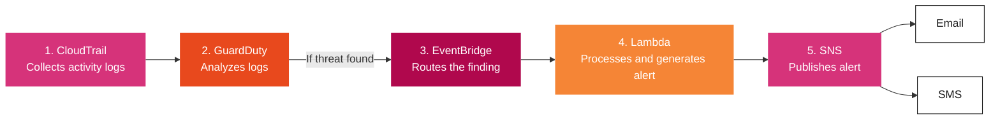

# Automated AI-Powered AWS Threat Detection System

A real-time, serverless security pipeline that detects threats in AWS accounts, enriches them with AI-generated context, and alerts admins instantly via Email and SMS, with no servers to manage.

## Overview

This project is an end-to-end threat detection and incident-response system built entirely on native AWS services. It continuously monitors account activity, automatically detects malicious behavior such as crypto-mining, unauthorized access, backdoors, and data exfiltration, and turns raw security findings into clear, actionable alerts within minutes, optionally enriched by Amazon Bedrock for plain-English risk summaries.

## Key Features

- Continuous threat monitoring across CloudTrail, VPC Flow Logs, and DNS logs via Amazon GuardDuty
- Real-time alerting: findings reach admins within minutes via Email and SMS
- Optional AI enrichment using Amazon Bedrock (Claude) for plain-English risk summaries
- Grounded remediation guidance from a curated knowledge base, so alerts never rely solely on model output
- Fully Infrastructure-as-Code: one CloudFormation template deploys the entire stack
- One-command deploy and destroy via shell scripts
- Live Streamlit dashboard that runs the exact same detection logic, no AWS credentials required

## Architecture Diagram



## Architecture Explanation

**CloudTrail** records every API call made across the AWS account. **GuardDuty** continuously analyzes that activity, along with VPC Flow Logs and DNS logs, using threat intelligence and anomaly detection. It emits a **Finding** whenever it spots malicious or suspicious behavior.

**EventBridge** picks up that finding in near real time and routes it to a **Lambda** function, which parses the finding, maps it to a remediation knowledge base (optionally calling **Amazon Bedrock** for an AI-generated summary), and formats a clear, readable alert.

**SNS** then fans that alert out to every subscriber, delivering it instantly via **Email and SMS**.

## Technology Stack

| Category | Tools / Services |
|---|---|
| **Cloud Provider** | AWS |
| **Security & Detection** | Amazon GuardDuty, AWS CloudTrail |
| **Compute** | AWS Lambda (Python 3.12) |
| **Eventing / Messaging** | Amazon EventBridge, Amazon SNS |
| **AI / ML** | Amazon Bedrock (Claude models) |
| **Infrastructure as Code** | AWS CloudFormation |
| **Web Dashboard** | Streamlit |
| **Languages** | Python, Bash, YAML |

## Repository Structure

```
aws-threat-detection-system/
│
├── lambda/          # Lambda function for threat processing
├── infrastructure/  # CloudFormation infrastructure
├── iam/             # IAM policies
├── scripts/         # Deployment and testing scripts
├── streamlit_app/   # Threat monitoring dashboard
├── README.md
└── requirements.txt
```

## How It Works

1. **CloudTrail** records every API call made across the AWS account.
2. **GuardDuty** continuously analyzes that activity (plus VPC Flow Logs and DNS logs) against threat intelligence feeds and anomaly-detection models.
3. When GuardDuty identifies suspicious or malicious behavior, it emits a **Finding**.
4. **EventBridge** picks up the finding in near real time and routes it to a Lambda function.
5. **Lambda** parses the finding, matches it against a remediation knowledge base (optionally calling **Amazon Bedrock** for an AI-generated summary), and formats a clear, actionable alert.
6. **SNS** delivers that alert to every subscriber instantly, via **Email and SMS**.

## Project Highlights / Key Learnings

- Designed and deployed a fully serverless, event-driven security pipeline using native AWS services with zero infrastructure to manage.
- Applied Infrastructure as Code (CloudFormation) to make the entire system reproducible and destroyable in a single command.
- Integrated a generative AI model (Amazon Bedrock/Claude) into a production alerting workflow, while keeping a deterministic, rule-based fallback so the system never depends solely on model output.
- Built and tested an event-driven architecture spanning detection (GuardDuty), eventing (EventBridge), compute (Lambda), and notification (SNS) layers.
- Practiced least-privilege IAM design, scoping the Lambda execution role to only the specific actions it needs.
- Built a parallel Streamlit dashboard that mirrors the production Lambda's exact logic, useful for demonstrating and testing detection behavior without needing live AWS infrastructure.
